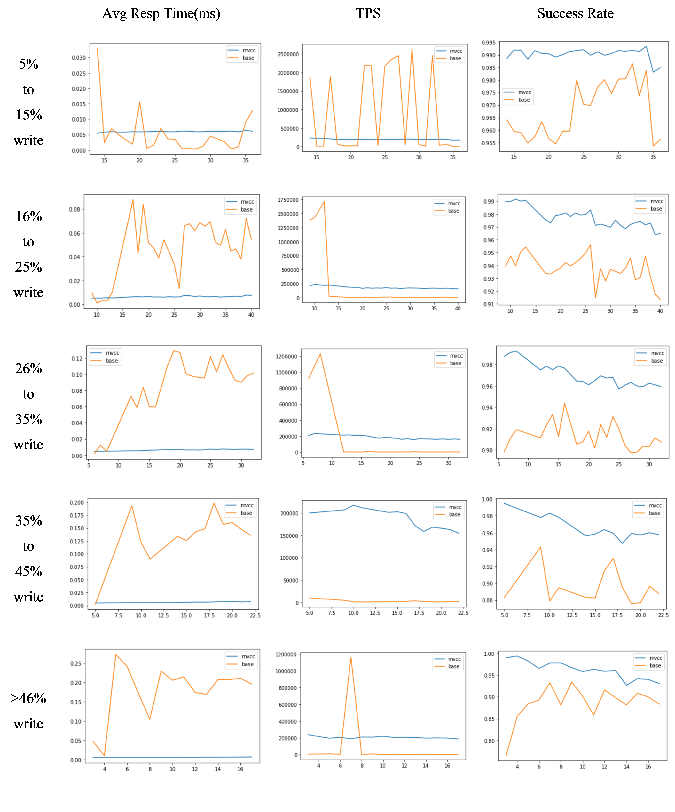
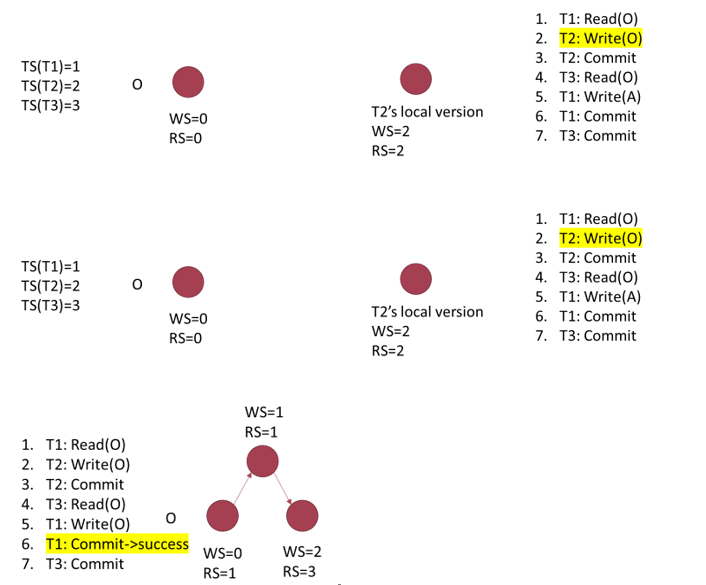

# MVCC-STM
## How to run
```Bash
$> mkdir build && cd build
$> cmake ..
$> make
$> cd ..
# run benchmark script
$> ./test.sh mvcc_stm4.log ./build/stm4 mvcc_stm
```

## Benchmark
The baseline algorithm comes from [Transactional Locking II](https://www.researchgate.net/publication/221234195_Transactional_Locking_II). The program is running on a 24-core debian system.


## Algorithm~

### Psuedocode
```
Transaction.read(O):
    Find predecessor P whose WS <= TS(Transaction)
    Update RS(P)=max( RS(P), TS(Transaction) )
    return P.value~

Transaction.write(O, value):
    Create a new version V, set WS(V)=RS(V)=TS(Transaction)
    Set V.value = value
    Add V into the local writeSet

Transaction.commit():
    For all V in writeSet:
        find P = predecessor(V), try to lock P
    For all V in writeSet:
        validate(P, V): RS(P) <= WS(V)
    For all V in writeSet:
        insert V after P

```

# Acknowledge
Thanks for [Xiangde Zeng](https://github.com/xanderzeng) for his contribution!!!